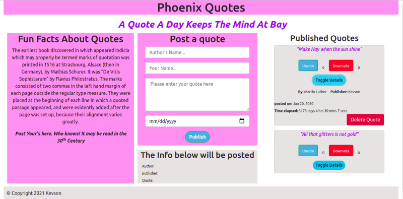

# Quote Web Application
#### This is a web application where the users can post their quotes, upvote and downvote for the quotes.
#### By **Nyambura Kelvin Njuguna**

## Description.
* This is a Web application were users can add posts Quotes and upvote or downvote them as they wish. After posting the quote, the user can view the time elapsed for every posted quote.

## Prototype.

## Setup/Installation Requirements.
* Install Google Chrome on your machine.
* Have nodejs installed on the computer/laptop.
* Have angular CLI installed
* 

## Live link.
https://kevson102.github.io/Phoenix-Quotes/

## Known Bugs
* NONE

## BDD
1. The application accepts the user inputs via a form
2. Only the valid inputs are accepted. Otherwise, the form fields will display an error message indicating the the field is required.
3. The user can delete a posted quote
4. The user can toggle between viewing and hiding the quote details.
5. The user can see the number of upvotes and downvotes for every quote.

## Build

Run `ng build` to build the project. The build artifacts will be stored in the `dist/` directory.

## Development server

Run `ng serve` for a dev server. Navigate to `http://localhost:4200/`. The app will automatically reload if you change any of the source files.

## Technologies Used
1. HTML
2. CSS
3. Angular
## Support and contact details
* Email: Kevson3941@gmail.com
* Phone no. +254 733 916258
### License
<a href="LICENSE.MD" target = "_blank">MIT</a>

Copyright (c) 2021 **Portfolio Landing page-Nyambura Kelvin Njuguna**
